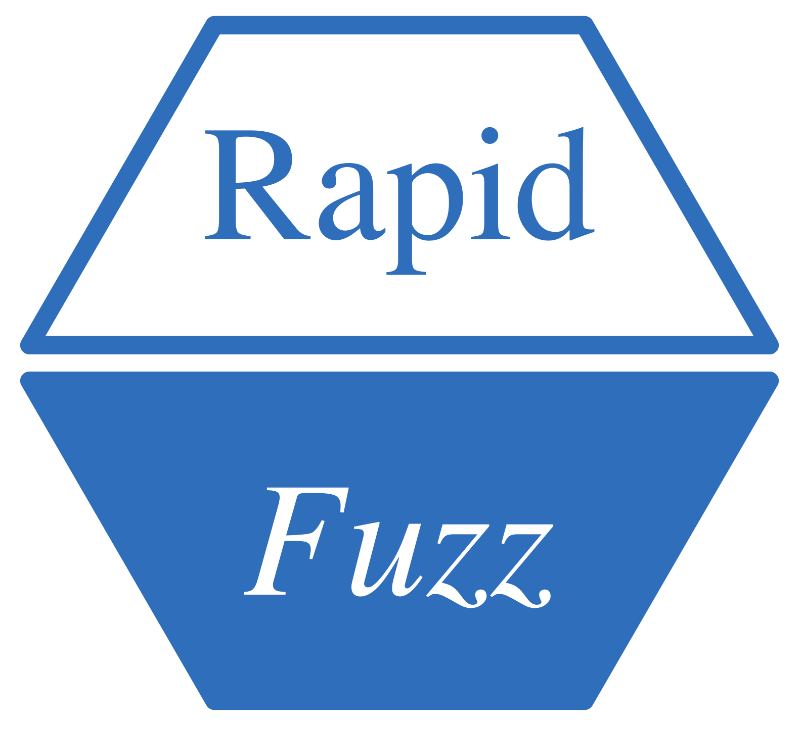

# RapidFuzz [](https://github.com/StrategicProjects/RapidFuzz)

  
  


Provides a high-performance interface for calculating string
similarities and distances, leveraging the efficient C++ library
[RapidFuzz](https://github.com/rapidfuzz/rapidfuzz-cpp) (v3.3.3)
developed by Max Bachmann and Adam Cohen. This package integrates the
C++ implementation, allowing R users to access cutting-edge algorithms
for fuzzy matching and text analysis.

## Installation

You can install directly from CRAN or the development version from
[GitHub](https://github.com/) with:

``` r

# install.packages("pak")
pak::pak("StrategicProjects/RapidFuzz")

library(RapidFuzz)
```

## Overview

The `RapidFuzz` package is an R wrapper around the highly efficient
RapidFuzz C++ library. It provides implementations of multiple string
comparison and similarity metrics, such as Levenshtein, Jaro-Winkler,
and Damerau-Levenshtein distances. This package is particularly useful
for applications like record linkage, approximate string matching, and
fuzzy text processing.

String comparison algorithms calculate distances and similarities
between two sequences of characters. These distances help to quantify
how similar two strings are. For example, the Levenshtein distance
measures the minimum number of single-character edits required to
transform one string into another.

RapidFuzz leverages advanced algorithms to ensure high performance while
maintaining accuracy. The original library is open-source and can be
accessed on [RapidFuzz GitHub
Repository](https://github.com/rapidfuzz/RapidFuzz).

------------------------------------------------------------------------

## Functions

### Process String Function

- [`processString()`](https://monitoramento.sepe.pe.gov.br/rapidfuzz/reference/processString.md):
  Process a string with options to trim, convert to lowercase, and
  transliterate to ASCII.

### Opcode Functions

- [`opcodes_apply_str()`](https://monitoramento.sepe.pe.gov.br/rapidfuzz/reference/opcodes_apply_str.md):
  Apply Opcodes to transform a string.
- [`opcodes_apply_vec()`](https://monitoramento.sepe.pe.gov.br/rapidfuzz/reference/opcodes_apply_vec.md):
  Apply Opcodes to transform a string into a character vector.

### Edit Operation Utilities

- [`get_editops()`](https://monitoramento.sepe.pe.gov.br/rapidfuzz/reference/get_editops.md):
  Retrieve Edit Operations between two strings.

### Edit Operations Functions

- [`editops_apply_str()`](https://monitoramento.sepe.pe.gov.br/rapidfuzz/reference/editops_apply_str.md):
  Apply Edit Operations to transform a string.
- [`editops_apply_vec()`](https://monitoramento.sepe.pe.gov.br/rapidfuzz/reference/editops_apply_vec.md):
  Apply Edit Operations to transform a string into a character vector.

### Damerau-Levenshtein Functions

- [`damerau_levenshtein_distance()`](https://monitoramento.sepe.pe.gov.br/rapidfuzz/reference/damerau_levenshtein_distance.md):
  Calculate the Damerau-Levenshtein Distance.
- [`damerau_levenshtein_normalized_distance()`](https://monitoramento.sepe.pe.gov.br/rapidfuzz/reference/damerau_levenshtein_normalized_distance.md):
  Calculate the Normalized Damerau-Levenshtein Distance.
- [`damerau_levenshtein_normalized_similarity()`](https://monitoramento.sepe.pe.gov.br/rapidfuzz/reference/damerau_levenshtein_normalized_similarity.md):
  Calculate the Normalized Damerau-Levenshtein Similarity.
- [`damerau_levenshtein_similarity()`](https://monitoramento.sepe.pe.gov.br/rapidfuzz/reference/damerau_levenshtein_similarity.md):
  Calculate the Damerau-Levenshtein Similarity.

### Fuzz Ratio Functions

- [`fuzz_QRatio()`](https://monitoramento.sepe.pe.gov.br/rapidfuzz/reference/fuzz_QRatio.md):
  Perform a Quick Ratio Calculation.
- [`fuzz_WRatio()`](https://monitoramento.sepe.pe.gov.br/rapidfuzz/reference/fuzz_WRatio.md):
  Perform a Weighted Ratio Calculation.
- [`fuzz_partial_ratio()`](https://monitoramento.sepe.pe.gov.br/rapidfuzz/reference/fuzz_partial_ratio.md):
  Calculate Partial Ratio.
- [`fuzz_ratio()`](https://monitoramento.sepe.pe.gov.br/rapidfuzz/reference/fuzz_ratio.md):
  Calculate a Simple Ratio.
- [`fuzz_token_ratio()`](https://monitoramento.sepe.pe.gov.br/rapidfuzz/reference/fuzz_token_ratio.md):
  Calculate Combined Token Ratio.
- [`fuzz_token_set_ratio()`](https://monitoramento.sepe.pe.gov.br/rapidfuzz/reference/fuzz_token_set_ratio.md):
  Perform Token Set Ratio Calculation.
- [`fuzz_token_sort_ratio()`](https://monitoramento.sepe.pe.gov.br/rapidfuzz/reference/fuzz_token_sort_ratio.md):
  Perform Token Sort Ratio Calculation.
- [`fuzz_partial_token_sort_ratio()`](https://monitoramento.sepe.pe.gov.br/rapidfuzz/reference/fuzz_partial_token_sort_ratio.md):
  Partial Token Sort Ratio (sorts words and uses partial ratio). **New
  in v1.1.0**
- [`fuzz_partial_token_set_ratio()`](https://monitoramento.sepe.pe.gov.br/rapidfuzz/reference/fuzz_partial_token_set_ratio.md):
  Partial Token Set Ratio (token set + partial ratio). **New in v1.1.0**
- [`fuzz_partial_token_ratio()`](https://monitoramento.sepe.pe.gov.br/rapidfuzz/reference/fuzz_partial_token_ratio.md):
  Combined Partial Token Ratio (max of partial token sort/set ratios).
  **New in v1.1.0**

### Extract Functions

- [`extract_similar_strings()`](https://monitoramento.sepe.pe.gov.br/rapidfuzz/reference/extract_similar_strings.md):
  Find all strings above a similarity threshold.
- [`extract_best_match()`](https://monitoramento.sepe.pe.gov.br/rapidfuzz/reference/extract_best_match.md):
  Find the best matching string from a set of choices.
- [`extract_matches()`](https://monitoramento.sepe.pe.gov.br/rapidfuzz/reference/extract_matches.md):
  Extract top-N matches using a configurable scorer.

### Hamming Functions

- [`hamming_distance()`](https://monitoramento.sepe.pe.gov.br/rapidfuzz/reference/hamming_distance.md):
  Calculate Hamming Distance.
- [`hamming_normalized_distance()`](https://monitoramento.sepe.pe.gov.br/rapidfuzz/reference/hamming_normalized_distance.md):
  Calculate Normalized Hamming Distance.
- [`hamming_normalized_similarity()`](https://monitoramento.sepe.pe.gov.br/rapidfuzz/reference/hamming_normalized_similarity.md):
  Calculate Normalized Hamming Similarity.
- [`hamming_similarity()`](https://monitoramento.sepe.pe.gov.br/rapidfuzz/reference/hamming_similarity.md):
  Calculate Hamming Similarity.

### Indel Functions

- [`indel_distance()`](https://monitoramento.sepe.pe.gov.br/rapidfuzz/reference/indel_distance.md):
  Calculate Indel Distance.
- [`indel_normalized_distance()`](https://monitoramento.sepe.pe.gov.br/rapidfuzz/reference/indel_normalized_distance.md):
  Calculate Normalized Indel Distance.
- [`indel_normalized_similarity()`](https://monitoramento.sepe.pe.gov.br/rapidfuzz/reference/indel_normalized_similarity.md):
  Calculate Normalized Indel Similarity.
- [`indel_similarity()`](https://monitoramento.sepe.pe.gov.br/rapidfuzz/reference/indel_similarity.md):
  Calculate Indel Similarity.

### Jaro Functions

- [`jaro_distance()`](https://monitoramento.sepe.pe.gov.br/rapidfuzz/reference/jaro_distance.md):
  Calculate Jaro Distance.
- [`jaro_normalized_distance()`](https://monitoramento.sepe.pe.gov.br/rapidfuzz/reference/jaro_normalized_distance.md):
  Calculate Normalized Jaro Distance.
- [`jaro_normalized_similarity()`](https://monitoramento.sepe.pe.gov.br/rapidfuzz/reference/jaro_normalized_similarity.md):
  Calculate Normalized Jaro Similarity.
- [`jaro_similarity()`](https://monitoramento.sepe.pe.gov.br/rapidfuzz/reference/jaro_similarity.md):
  Calculate Jaro Similarity.

### Jaro-Winkler Functions

- [`jaro_winkler_distance()`](https://monitoramento.sepe.pe.gov.br/rapidfuzz/reference/jaro_winkler_distance.md):
  Calculate Jaro-Winkler Distance.
- [`jaro_winkler_normalized_distance()`](https://monitoramento.sepe.pe.gov.br/rapidfuzz/reference/jaro_winkler_normalized_distance.md):
  Calculate Normalized Jaro-Winkler Distance.
- [`jaro_winkler_normalized_similarity()`](https://monitoramento.sepe.pe.gov.br/rapidfuzz/reference/jaro_winkler_normalized_similarity.md):
  Calculate Normalized Jaro-Winkler Similarity.
- [`jaro_winkler_similarity()`](https://monitoramento.sepe.pe.gov.br/rapidfuzz/reference/jaro_winkler_similarity.md):
  Calculate Jaro-Winkler Similarity.

### Longest Common Subsequence (LCSseq) Functions

- [`lcs_seq_distance()`](https://monitoramento.sepe.pe.gov.br/rapidfuzz/reference/lcs_seq_distance.md):
  Calculate LCSseq Distance.
- [`lcs_seq_editops()`](https://monitoramento.sepe.pe.gov.br/rapidfuzz/reference/lcs_seq_editops.md):
  Retrieve LCSseq Edit Operations.
- [`lcs_seq_normalized_distance()`](https://monitoramento.sepe.pe.gov.br/rapidfuzz/reference/lcs_seq_normalized_distance.md):
  Calculate Normalized LCSseq Distance.
- [`lcs_seq_normalized_similarity()`](https://monitoramento.sepe.pe.gov.br/rapidfuzz/reference/lcs_seq_normalized_similarity.md):
  Calculate Normalized LCSseq Similarity.
- [`lcs_seq_similarity()`](https://monitoramento.sepe.pe.gov.br/rapidfuzz/reference/lcs_seq_similarity.md):
  Calculate LCSseq Similarity.

### Levenshtein Functions

- [`levenshtein_distance()`](https://monitoramento.sepe.pe.gov.br/rapidfuzz/reference/levenshtein_distance.md):
  Calculate Levenshtein Distance.
- [`levenshtein_normalized_distance()`](https://monitoramento.sepe.pe.gov.br/rapidfuzz/reference/levenshtein_normalized_distance.md):
  Calculate Normalized Levenshtein Distance.
- [`levenshtein_normalized_similarity()`](https://monitoramento.sepe.pe.gov.br/rapidfuzz/reference/levenshtein_normalized_similarity.md):
  Calculate Normalized Levenshtein Similarity.
- [`levenshtein_similarity()`](https://monitoramento.sepe.pe.gov.br/rapidfuzz/reference/levenshtein_similarity.md):
  Calculate Levenshtein Similarity.

### Optimal String Alignment (OSA) Functions

- [`osa_distance()`](https://monitoramento.sepe.pe.gov.br/rapidfuzz/reference/osa_distance.md):
  Calculate Distance Using OSA.
- [`osa_editops()`](https://monitoramento.sepe.pe.gov.br/rapidfuzz/reference/osa_editops.md):
  Retrieve Edit Operations Using OSA.
- [`osa_normalized_distance()`](https://monitoramento.sepe.pe.gov.br/rapidfuzz/reference/osa_normalized_distance.md):
  Calculate Normalized Distance Using OSA.
- [`osa_normalized_similarity()`](https://monitoramento.sepe.pe.gov.br/rapidfuzz/reference/osa_normalized_similarity.md):
  Calculate Normalized Similarity Using OSA.
- [`osa_similarity()`](https://monitoramento.sepe.pe.gov.br/rapidfuzz/reference/osa_similarity.md):
  Calculate Similarity Using OSA.

### Prefix Functions

- [`prefix_distance()`](https://monitoramento.sepe.pe.gov.br/rapidfuzz/reference/prefix_distance.md):
  Calculate the Prefix Distance between two strings.
- [`prefix_normalized_distance()`](https://monitoramento.sepe.pe.gov.br/rapidfuzz/reference/prefix_normalized_distance.md):
  Calculate the Normalized Prefix Distance between two strings.
- [`prefix_normalized_similarity()`](https://monitoramento.sepe.pe.gov.br/rapidfuzz/reference/prefix_normalized_similarity.md):
  Calculate the Normalized Prefix Similarity between two strings.
- [`prefix_similarity()`](https://monitoramento.sepe.pe.gov.br/rapidfuzz/reference/prefix_similarity.md):
  Calculate the Prefix Similarity between two strings.

### Postfix Functions

- [`postfix_distance()`](https://monitoramento.sepe.pe.gov.br/rapidfuzz/reference/postfix_distance.md):
  Calculate the Postfix Distance between two strings.
- [`postfix_normalized_distance()`](https://monitoramento.sepe.pe.gov.br/rapidfuzz/reference/postfix_normalized_distance.md):
  Calculate the Normalized Postfix Distance between two strings.
- [`postfix_normalized_similarity()`](https://monitoramento.sepe.pe.gov.br/rapidfuzz/reference/postfix_normalized_similarity.md):
  Calculate the Normalized Postfix Similarity between two strings.
- [`postfix_similarity()`](https://monitoramento.sepe.pe.gov.br/rapidfuzz/reference/postfix_similarity.md):
  Calculate the Postfix Similarity between two strings.

------------------------------------------------------------------------

## Example Usage

### Prefix Functions

``` r

prefix_distance("abcdef", "abcxyz")
# Output: 3

prefix_normalized_similarity("abcdef", "abcxyz", score_cutoff = 0.0)
# Output: 0.5
```

### Postfix Functions

``` r

postfix_distance("abcdef", "xyzdef")
# Output: 3
```

### Damerau-Levenshtein Functions

``` r

damerau_levenshtein_distance("abcdef", "abcfed")
# Output: 2
```

### Partial Token Ratios (New in v1.1.0)

``` r

fuzz_partial_token_sort_ratio("fuzzy wuzzy was a bear", "wuzzy fuzzy was a bear")
# Output: 100

fuzz_partial_token_set_ratio("fuzzy wuzzy was a bear", "fuzzy fuzzy was a bear")
# Output: 100

fuzz_partial_token_ratio("fuzzy wuzzy was a bear", "wuzzy fuzzy was a bear")
# Output: 100
```

### Extract Matches

``` r

# Example data
query <- "new york jets"
choices <- c("Atlanta Falcons", "New York Jets", "New York Giants", "Dallas Cowboys")
score_cutoff <- 0.0

# Find the best match
extract_matches(query, choices, score_cutoff, scorer = "PartialRatio")
# Output:
#            choice     score
# 1   New York Jets 100.00000
# 2 New York Giants  81.81818
# 3 Atlanta Falcons  33.33333

# Using new scorers (v1.1.0)
extract_matches(query, choices, score_cutoff, scorer = "PartialTokenRatio")
```

------------------------------------------------------------------------

### Original Library

The `RapidFuzz` package is a wrapper of the
[RapidFuzz](https://github.com/rapidfuzz/rapidfuzz-cpp) C++ library
(v3.3.3), developed by Max Bachmann and Adam Cohen. The library
implements efficient algorithms for approximate string matching and
comparison.

[](https://rapidfuzz.github.io/RapidFuzz/)\]
